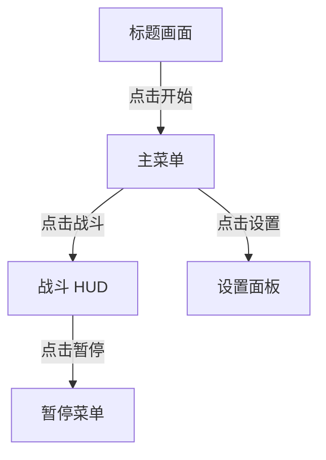

# 游戏低保真交互原型 (Game Lo-Fi Interactive Prototype)

在高保真 HTML/CSS 之前，用**等宽线框 + 4色灰度**快速产出可点击的 HTML 线框图，验证交互流是否正确。
目标是**先跑通流程，再追求好看**。

---

## 何时使用

- 用户说"做一版线框图"/"低保真原型"/"快速验证交互"
- 用户描述了新功能的多屏幕流程，需要可视化验证
- 用户已经有了功能策划案，要进入 UI 设计阶段
- 用户想快速验证某个交互模式（弹窗/列表/网格选择）是否顺手

**何时不使用**：
- 用户要的是高保真 HTML 原型 → 进入现有 HTML 原型管线
- 用户要的是代码实现 → 触发 godot-ui-control 或 game-ui-ux
- 用户要的是美术资产 → 走美术管线

---

## 两种启动模式

### 🚀 快速模式（推荐首发项目）

用户说「快速设计一个交互规范和视觉系统」→ 走 **3 步快速启动**，声明规则后直接画线框图：

```
① 选择平台 → ② 交互规则声明 → ③ 视觉系统声明 → 画线框图（跳过④⑤的规范部分）
```

> 📖 快速启动模板（平台预设、规则表格、色彩色板）见 `references/quick-start.md`

### 📋 完整模式（复杂项目/首次使用）

用户说「做低保真原型」→ 走下面完整的六步工作流。

---

## 完整六步工作流

严格按这六步执行。每步完成后向用户确认，不要跳步。

### ① 场景梳理 —— 「有哪些屏幕？怎么流转？」

**目标**：把所有要原型化的屏幕列清楚，画出流转图。

1. 和用户逐屏确认：名称 + 入口（从哪来）+ 出口（去哪）
2. 画出屏幕流转图（ASCII 或 Mermaid 格式），标注触发动作
3. 区分核心路径（必须走通）和边缘路径（取消/返回/错误恢复）



**产出**：屏幕清单 + 流转图（放在对话中展示，用户确认即可）

---

### ② 交互骨架 —— 「每屏的状态和焦点怎么走？」

**目标**：对每屏建模状态机和焦点导航路径。

**只做核心路径的屏幕**，边缘路径屏幕只需列出状态，不画线框图。

1. **状态机**：每个屏幕标注 idle / loading / empty / error 四态
2. **组件状态**：关键按钮标注 idle / active / disabled / selected / focus 五态
3. **焦点导航**：
   - 触摸交互：高通按钮在拇指热区（Y: 800~1334px），最小触控区域 44×44px
   - 手柄导航：每屏初始焦点 + D-pad 方向（↑↓←→到哪个元素）
   - 弹窗焦点陷阱：弹窗内循环，不泄漏到背景层
4. **过渡声明**：每对屏幕之间标注过渡方式（fade / slide / scale / none）

**产出**：每屏的状态列表 + 焦点路径（对话中输出，不写文件）

> 📖 详细规范见 `references/interaction-spec.md`（仅在需要具体代码模板时加载）

---

### ③ 低保真视觉规范 —— 「线框图长什么样？」

**目标**：声明本原型的视觉规则，保证所有屏幕视觉一致。

**硬性约束**（必须遵守）：

| 约束 | 值 |
|------|-----|
| 画布 | 750×1334px，居中展示 |
| 色彩 | 仅4色：线框黑 `#222` / 填充灰 `#E0E0E0` / 强调灰 `#999` / 背景白 `#FAFAFA` |
| 字体 | 仅一种等宽字体，两个字号（标题 24px / 正文 16px） |
| 网格 | 8px 基础单位，所有间距为 8 的倍数 |
| 线框 | 线宽 2px，圆角 4px，无阴影，无渐变，无彩色 |
| 图片 | 全部用斜线填充占位符 + 文字标注 |

**向用户声明后开始画线框图。** 如果用户提出特定风格要求（如"像手绘笔记"或用特定字体），在此步调整规范。

> 📖 完整 CSS 变量和基础组件样式见 `references/visual-spec.md`（首次画线框图时加载）

---

### ④ 线框图草稿 —— 「一屏一个 HTML 文件」

**目标**：为每屏产出自包含的 HTML 线框图。

1. **每屏一个文件**，命名：`{序号}-{屏幕名拼音}-lo-fi.html`
2. **零依赖**：inline CSS + 结构 HTML，双击浏览器即可预览
3. **先骨架后细节**：先画容器布局（header/content/footer），再填组件
4. **占位符标注**：
   - 未确定的图片 → 斜线填充矩形 + `[图片描述]`
   - 未确定的文字 → `[文字占位]` 或 `～～～～～～`
   - 可点击区域 → 虚线框
5. **注释关键决策**：`<!-- 此处用列表而非网格，因为最多 5 项 -->`

```css
/* 每个原型文件的 CSS 基础（必须包含） */
*, *::before, *::after { box-sizing: border-box; margin: 0; padding: 0; }
:root {
  --lo-ink: #222; --lo-fill: #E0E0E0; --lo-muted: #999; --lo-bg: #FAFAFA;
}
body {
  width: 750px; min-height: 1334px; margin: 0 auto;
  background: var(--lo-bg);
  font-family: 'Courier New', monospace;
}
```

> 📖 完整组件 HTML 模板（HUD/菜单/列表/弹窗/网格/进度条/Tab）见 `references/component-library.md`（需要具体组件代码时加载）

---

### ⑤ 交互原型串接 —— 「可点击走通」

**目标**：让所有线框图串联成可点击走通的流程。

1. 在每屏的按钮/可点击区域加上 `href` 或 `onclick` 跳转到下一屏
2. 标注可点击区域（虚线框 `outline: 2px dashed`）
3. 模拟关键状态切换（弹窗打开/关闭、按钮激活态）
4. 确认：**核心路径能从头到尾在浏览器中走通**

```html
<!-- 跳转方式 -->
<a href="02-qi-ling-xuanze-lo-fi.html" class="lo-btn">[开始游戏]</a>

<!-- 弹窗开关（inline JS） -->
<button onclick="document.getElementById('modal').style.display='flex'">
  [打开设置]
</button>
```

---

### ⑥ 走查清单 —— 「有没有坑？」

**目标**：逐项检查交互流程的完整性。

用以下清单逐屏走查。**先走核心路径，再走边缘路径。**

#### 屏幕流转
- [ ] 每屏有明确入口和出口？
- [ ] 每层弹窗有关闭/返回机制？
- [ ] 深层页面（>3层）有快捷返回方式？
- [ ] 弹窗关闭后焦点回到触发按钮？

#### 触控与焦点
- [ ] 所有可点击元素 ≥ 44×44px？
- [ ] 高频按钮在拇指热区（Y: 800~1334px）？
- [ ] 手柄焦点有初始位置、不会掉出屏幕？

#### 状态覆盖
- [ ] 按钮有 idle / active / disabled 三态？
- [ ] 列表/网格有 empty 态？
- [ ] 有 loading 和 error 态？

#### 视觉一致性
- [ ] 只用 4 种颜色？
- [ ] 间距是 8 的倍数？
- [ ] 只用一种等宽字体？
- [ ] 无线框风格之外的视觉元素？

> 📖 完整审查清单见 `references/anti-patterns.md`（走查时加载）

---

## 产出物放置

```
projects/<项目名>/ui-prototypes/lo-fi/
├── 01-<屏幕A>-lo-fi.html
├── 02-<屏幕B>-lo-fi.html
├── 03-<屏幕C>-lo-fi.html
└── _flow.md                        # 屏幕流转图 + 状态机汇总（可选）
```

---

## 与现有管线的关系

```
功能策划案 → 本技能（低保真交互原型）→ 通过走查 → HTML 高保真原型 → Pixso → 代码
                ↑ 如果走查发现问题，回到②交互骨架修改
```

触发方式：**仅用户主动明确调用**（如 `/game-lo-fi-prototype` 或说出「低保真原型」）。不会自动级联。

---

## 关键原则

1. **完成比完美重要** — 线框图不追求像素级精确，重点是验证交互流
2. **先走通再优化** — 核心路径跑通了再管边缘情况
3. **剥离色彩干扰** — 低保真的意义就是让你专注布局和交互，不被配色分心
4. **每步确认** — 六步中每步产出都给用户看一眼，别闷头全做完
5. **不跳到高保真** — 线框图通过了才进入 HTML 高保真。不要在这一步做视觉设计
